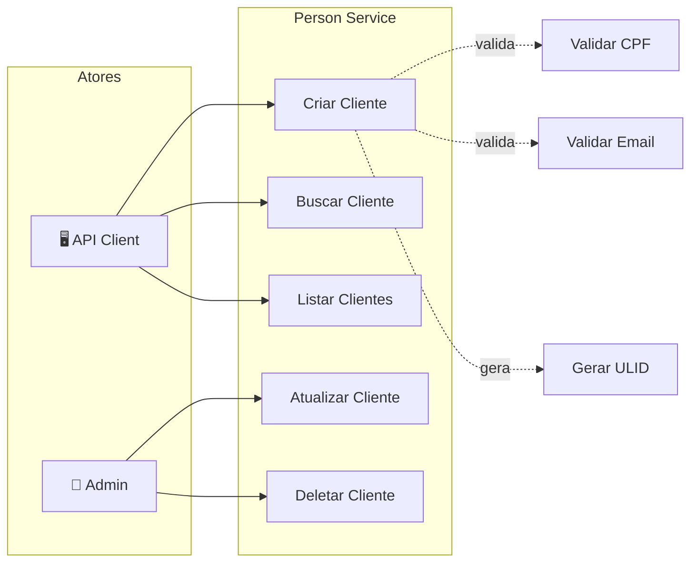
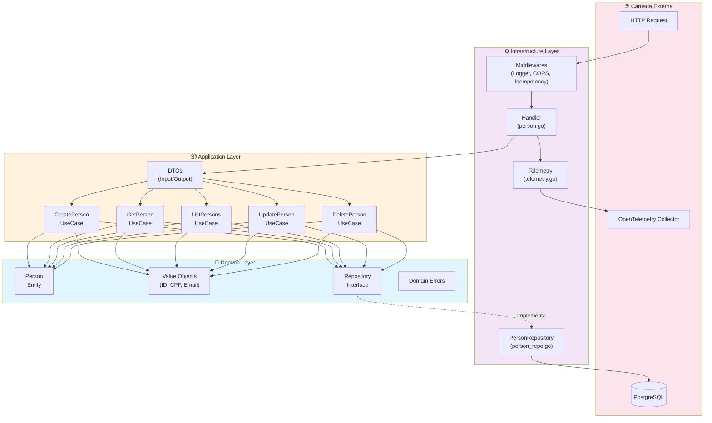
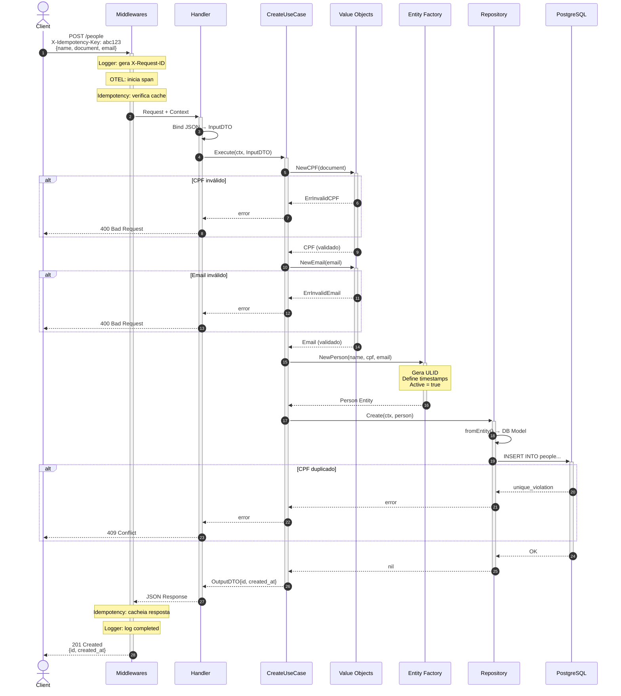
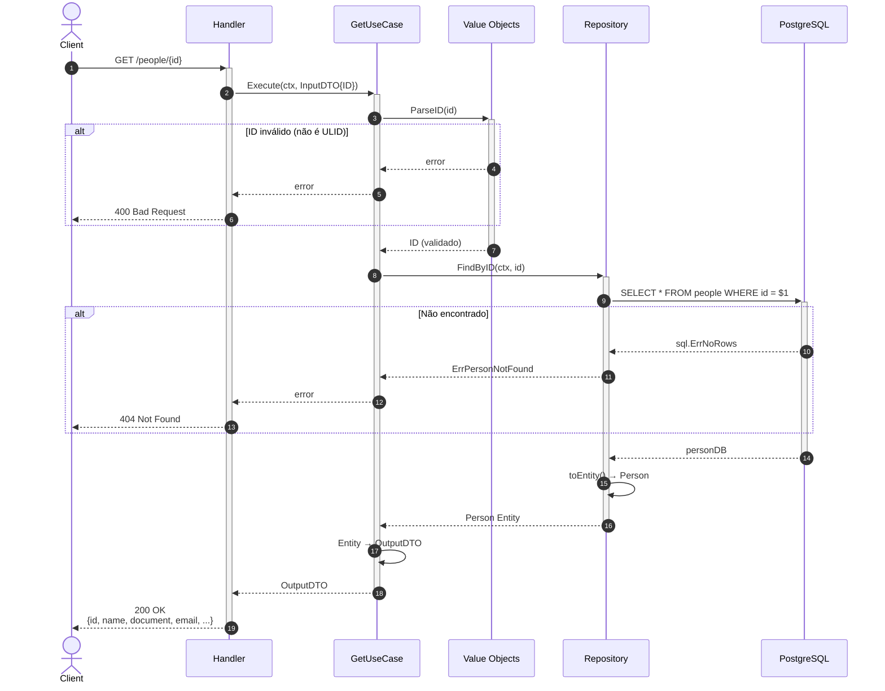
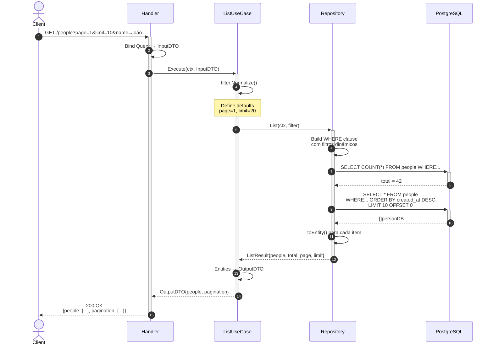
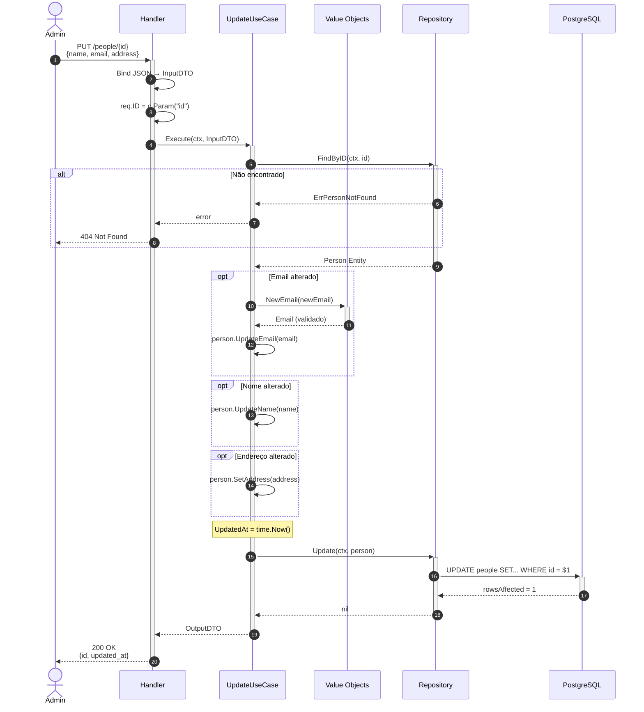
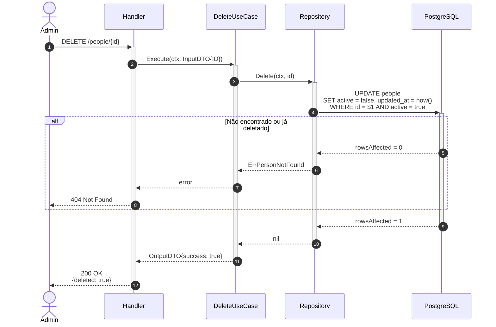
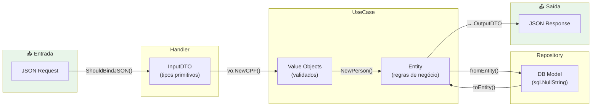

# Arquitetura do Person Service

Documentação técnica da arquitetura do microsserviço de gestão de clientes, seguindo **Clean Architecture** e **DDD**.

---

## Sumário

- [Diagrama de Casos de Uso](#diagrama-de-casos-de-uso)
- [Diagrama de Componentes](#diagrama-de-componentes-clean-architecture)
- [Diagramas de Sequência](#diagramas-de-sequência)
  - [Criar Cliente](#1-criar-cliente)
  - [Buscar Cliente por ID](#2-buscar-cliente-por-id)
  - [Listar Clientes](#3-listar-clientes)
  - [Atualizar Cliente](#4-atualizar-cliente)
  - [Deletar Cliente](#5-deletar-cliente-soft-delete)
- [Fluxo de Dados](#fluxo-de-dados-entre-camadas)

---

## Diagrama de Casos de Uso



### Descrição dos Casos de Uso

| Caso de Uso | Ator | Descrição |
|---|---|---|
| **Criar Cliente** | API Client | Cadastra novo cliente com validação de CPF/Email |
| **Buscar Cliente** | API Client | Retorna dados de um cliente por ID |
| **Listar Clientes** | API Client | Lista clientes com paginação e filtros |
| **Atualizar Cliente** | Admin | Atualiza dados de um cliente existente |
| **Deletar Cliente** | Admin | Realiza soft delete (active=false) |

---

## Diagrama de Componentes (Clean Architecture)



### Regra de Dependência

> 💡 **As dependências sempre apontam para DENTRO** (em direção ao Domain).

```
External → Infrastructure → Application → Domain
```

O **Domain** não conhece nenhuma outra camada. O **Application** conhece apenas o Domain. E assim por diante.

---

## Diagramas de Sequência

### 1. Criar Cliente



---

### 2. Buscar Cliente por ID



---

### 3. Listar Clientes



---

### 4. Atualizar Cliente



---

### 5. Deletar Cliente (Soft Delete)



---

## Fluxo de Dados Entre Camadas



### Transformações de Dados

| Camada | Tipo de Dado | Exemplo |
|---|---|---|
| **HTTP** | JSON string | `{"document": "529.982.247-25"}` |
| **Handler** | InputDTO (primitivos) | `Document string` |
| **UseCase** | Value Object (validado) | `vo.CPF{value: "52998224725"}` |
| **Entity** | Agregado completo | `Person{CPF, Email, ID, ...}` |
| **Repository** | DB Model (nullable) | `personDB{Document: "52998224725"}` |
| **Database** | SQL | `document VARCHAR(11)` |

---

## Estrutura de Diretórios

```
internal/
├── domain/                    # 💎 Camada de Domínio
│   └── person/
│       ├── entity.go          # Entidade Person
│       ├── repository.go      # Interface Repository
│       ├── errors.go          # Erros de domínio
│       ├── filter.go          # Filtros de listagem
│       └── vo/                # Value Objects
│           ├── id.go          # ULID
│           ├── cpf.go         # CPF (MOD 11)
│           ├── email.go       # Email (RFC 5322)
│           └── address.go     # Endereço
│
├── usecase/                   # 📦 Camada de Aplicação
│   ├── create_person/
│   │   ├── dto.go             # Input/Output DTOs
│   │   └── usecase.go         # Lógica de orquestração
│   ├── get_person/
│   ├── list_people/
│   ├── update_person/
│   └── delete_person/
│
├── infrastructure/            # ⚙️ Camada de Infraestrutura
│   ├── db/
│   │   ├── postgres.go        # Conexão com banco
│   │   └── repository/
│   │       └── person_repo.go  # Implementação do Repository
│   ├── web/
│   │   ├── handler/
│   │   │   └── person.go    # HTTP Handlers
│   │   └── middleware/
│   │       ├── logger.go      # Logging estruturado
│   │       ├── idempotency.go # Idempotência
│   └── telemetry/
│       └── otel.go            # OpenTelemetry setup
│
├── server/
│   └── server.go              # Bootstrap e DI
│
└── pkg/
    └── apperror/              # Erros de aplicação
```

---

## Referências

- [Clean Architecture - Uncle Bob](https://blog.cleancoder.com/uncle-bob/2012/08/13/the-clean-architecture.html)
- [Domain-Driven Design - Eric Evans](https://domainlanguage.com/ddd/)
- [ULID Spec](https://github.com/ulid/spec)
- [OpenTelemetry Go](https://opentelemetry.io/docs/instrumentation/go/)
