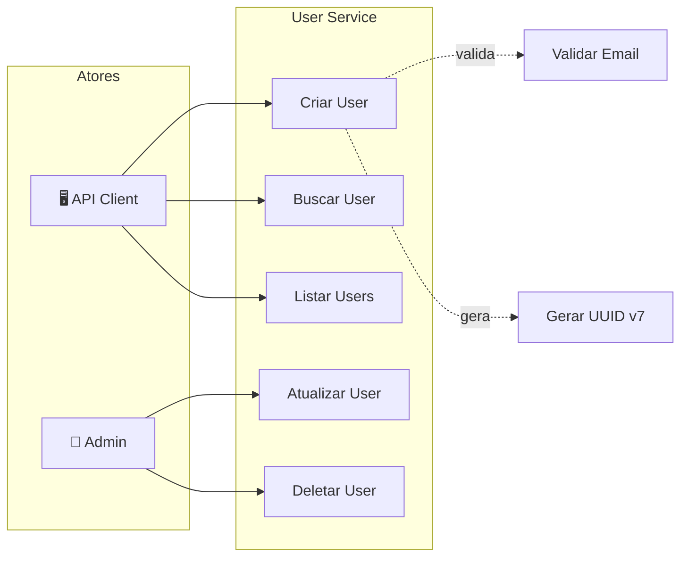
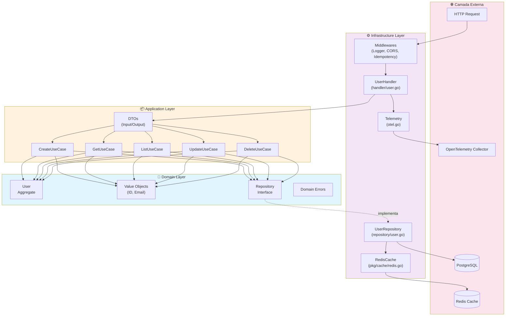
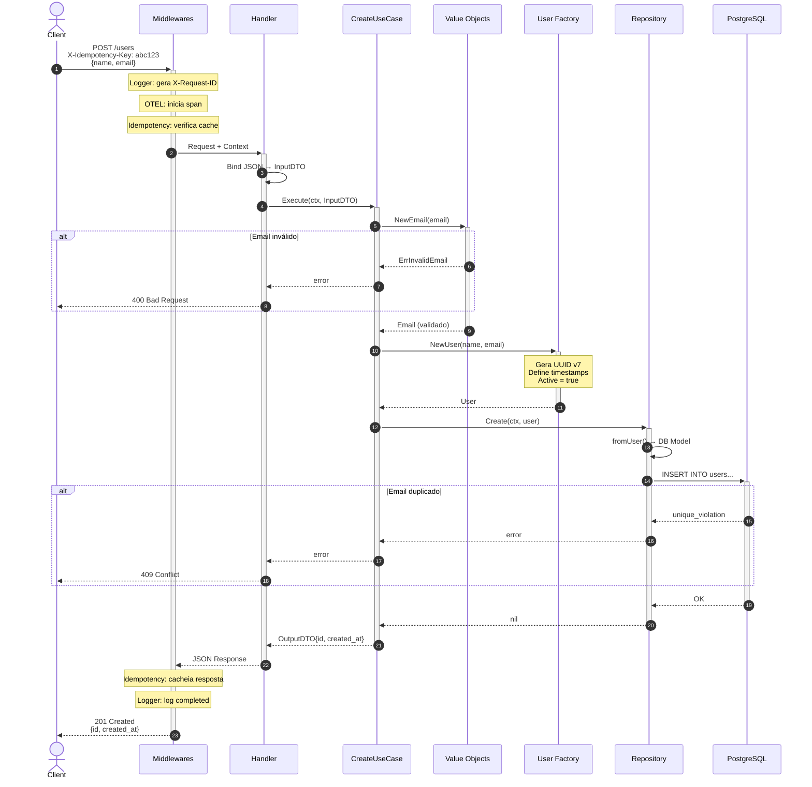
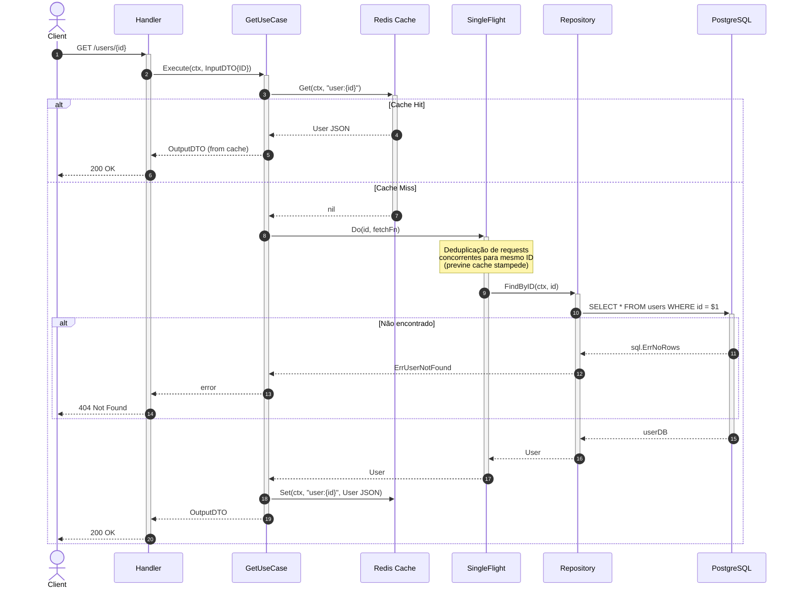
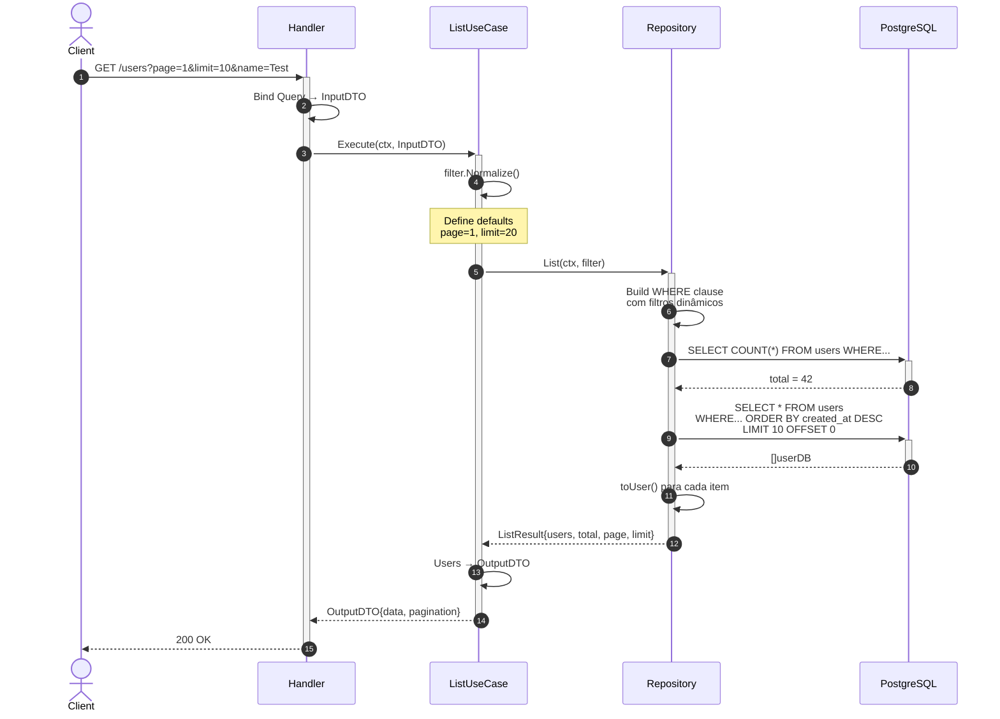
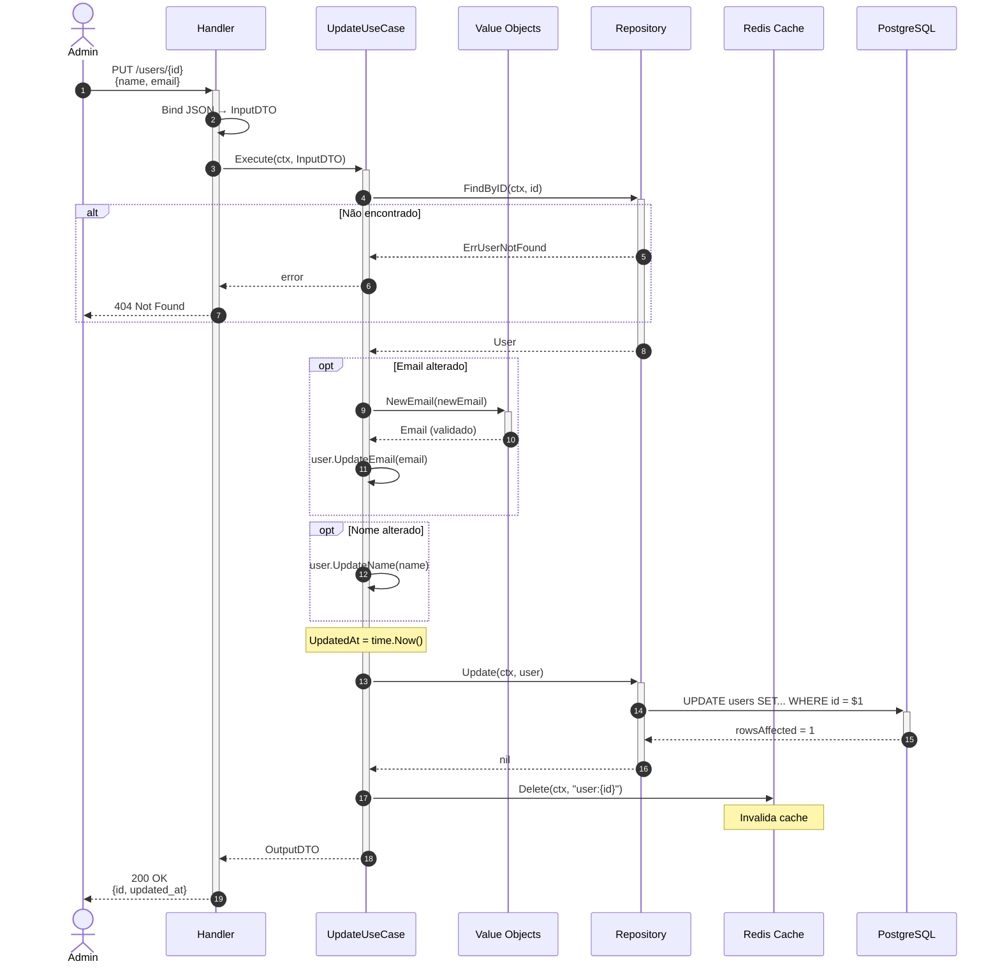
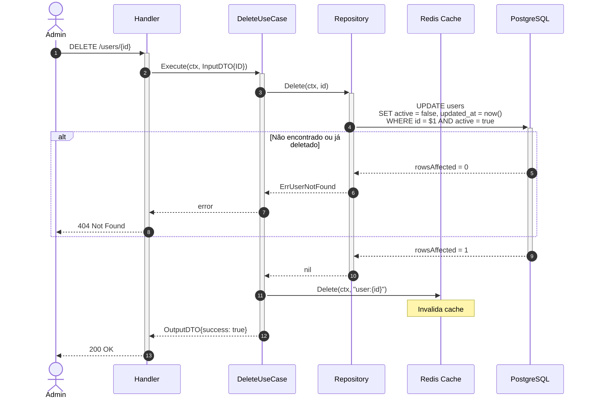
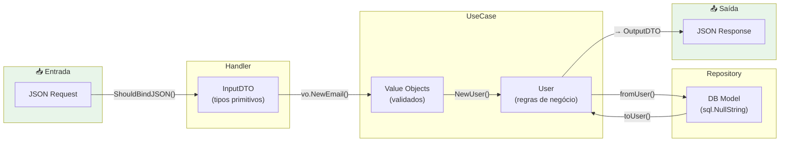

# Arquitetura do User Service

Documentação técnica da arquitetura do microsserviço de gestão de usuários, seguindo **Clean Architecture** e **DDD**.

---

## Sumário

- [Diagrama de Casos de Uso](#diagrama-de-casos-de-uso)
- [Diagrama de Componentes](#diagrama-de-componentes-clean-architecture)
- [Diagramas de Sequência](#diagramas-de-sequência)
  - [Criar User](#1-criar-user)
  - [Buscar User por ID](#2-buscar-user-por-id)
  - [Listar Users](#3-listar-users)
  - [Atualizar User](#4-atualizar-user)
  - [Deletar User](#5-deletar-user-soft-delete)
- [Fluxo de Dados](#fluxo-de-dados-entre-camadas)

---

## Diagrama de Casos de Uso



### Descrição dos Casos de Uso

| Caso de Uso | Ator | Descrição |
| --- | --- | --- |
| **Criar User** | API Client | Cadastra novo usuário com validação de email e geração de UUID v7 |
| **Buscar User** | API Client | Retorna dados de um usuário por ID (com cache) |
| **Listar Users** | API Client | Lista usuários com paginação e filtros (nome, email, active) |
| **Atualizar User** | Admin | Atualiza dados (nome, email) de um usuário existente |
| **Deletar User** | Admin | Realiza soft delete (active=false) |

---

## Diagrama de Componentes (Clean Architecture)



### Regra de Dependência

> 💡 **As dependências sempre apontam para DENTRO** (em direção ao Domain).

```text
External → Infrastructure → Application → Domain
```

O **Domain** não conhece nenhuma outra camada. O **Application** conhece apenas o Domain. E assim por diante.

---

## Diagramas de Sequência

### 1. Criar User



---

### 2. Buscar User por ID



---

### 3. Listar Users



---

### 4. Atualizar User



---

### 5. Deletar User (Soft Delete)



---

## Fluxo de Dados Entre Camadas



### Transformações de Dados

| Camada | Tipo de Dado | Exemplo |
| --- | --- | --- |
| **HTTP** | JSON string | `{"name": "Alice", "email": "alice@example.com"}` |
| **Handler** | InputDTO (primitivos) | `dto.CreateInput{Name: "Alice"}` |
| **UseCase** | Value Object (validado) | `vo.Email{value: "alice@example.com"}` |
| **Entity** | Agregado completo | `User{ID, Name, Email, Active...}` |
| **Repository** | DB Model (nullable) | `userDB{Name: "Alice", Email: "..."}` |
| **Database** | SQL | `name VARCHAR(255)` |

---

## Estrutura de Diretórios

```text
internal/
├── domain/                    # 💎 Camada de Domínio
│   └── user/
│       ├── user.go            # Aggregate User
│       ├── errors.go          # Erros de domínio
│       ├── filter.go          # Filtros de listagem
│       └── vo/                # Value Objects
│           ├── id.go          # UUID v7 (RFC 9562)
│           ├── email.go       # Email (RFC 5322)
│           └── errors.go      # Erros de VO
│
├── usecases/                  # 📦 Camada de Aplicação
│   └── user/
│       ├── create.go          # Use Case de Criação
│       ├── get.go             # Use Case de Leitura
│       ├── list.go            # Use Case de Listagem
│       ├── update.go          # Use Case de Atualização
│       ├── delete.go          # Use Case de Remoção
│       ├── dto/               # Input/Output DTOs
│       └── interfaces/        # Interfaces (Repository, Cache)
│
├── infrastructure/            # ⚙️ Camada de Infraestrutura
│   ├── cache/                 # Legacy (ver pkg/cache/ para novo código)
│   │   └── redis.go
│   ├── db/
│   │   ├── postgres/          # Implementação Postgres
│   │   │   ├── repository/
│   │   │   └── migration/
│   ├── web/
│   │   ├── handler/
│   │   │   └── user.go         # HTTP Handlers
│   │   ├── middleware/        # Middlewares (Logger, Auth, etc)
│   │   └── router/            # Rotas Gin
│   └── telemetry/
│       └── otel.go            # OpenTelemetry setup
│
├── cmd/api/                   # Entrypoint
└── config/                    # Configurações
```

---

## Referências

- [Clean Architecture - Uncle Bob](https://blog.cleancoder.com/uncle-bob/2012/08/13/the-clean-architecture.html)
- [Domain-Driven Design - Eric Evans](https://domainlanguage.com/ddd/)
- [RFC 9562 (UUID v7)](https://www.rfc-editor.org/rfc/rfc9562)
- [OpenTelemetry Go](https://opentelemetry.io/docs/instrumentation/go/)
