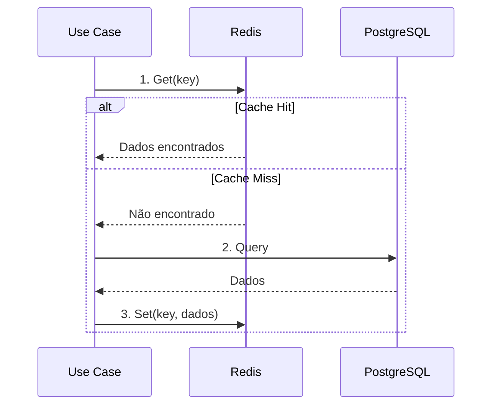
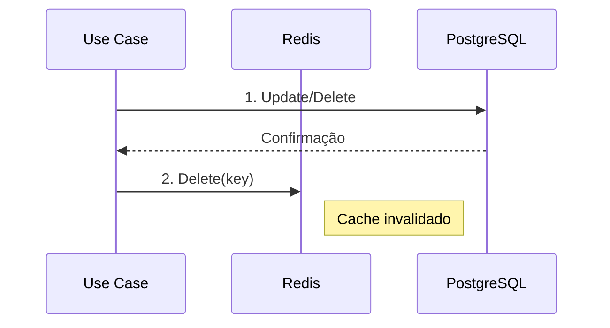

# Cache Strategy

Este guia explica o padrão de cache implementado neste projeto e como utilizá-lo.

---

## Cache-Aside Pattern

O **Cache-Aside** (ou Lazy Loading) é o padrão de cache mais comum para aplicações web. A aplicação é responsável por gerenciar o cache explicitamente.

### Fluxo de Leitura (GET)



### Fluxo de Escrita (UPDATE/DELETE)



---

## Implementação

### Interface

A interface de cache está definida em [`pkg/cache/cache.go`](../../pkg/cache/cache.go):

```go
type Cache interface {
    Get(ctx context.Context, key string, dest interface{}) error
    Set(ctx context.Context, key string, value interface{}) error
    Delete(ctx context.Context, key string) error
    Ping(ctx context.Context) error
    Close() error
}
```

### Cliente Redis

A implementação está em [`pkg/cache/redisclient/client.go`](../../pkg/cache/redisclient/client.go):

| Método | Descrição |
| -------- | ----------- |
| `Get` | Busca e deserializa do cache (retorna `ErrCacheMiss` se não encontrado) |
| `Set` | Serializa e armazena com TTL configurado |
| `Delete` | Invalida uma chave |
| `Ping` | Health check da conexão |
| `Close` | Fecha a conexão Redis |
| `UnderlyingClient` | Retorna o `*redis.Client` para uso por outros pacotes (ex: `pkg/idempotency`) |

> **Nota:** Todas as operações em `*RedisClient` nil são no-ops seguros (nil-safe pattern).

### Uso nos Use Cases

```go
// GET - Cache-first com singleflight
func (uc *GetUseCase) Execute(ctx context.Context, input dto.GetInput) (*dto.GetOutput, error) {
    cacheKey := "user:" + input.ID

    // 1. Tentar cache primeiro
    if uc.Cache != nil {
        var cached dto.GetOutput
        if cacheErr := uc.Cache.Get(ctx, cacheKey, &cached); cacheErr == nil {
            return &cached, nil // Cache hit
        }
    }

    // 2. Cache miss - buscar no DB (com singleflight para evitar stampede)
    var u *user.User
    if uc.Flight != nil {
        val, flightErr, _ := uc.Flight.byID.Do(input.ID, func() (any, error) {
            return uc.Repo.FindByID(ctx, id)
        })
        if flightErr != nil {
            return nil, flightErr
        }
        u = val.(*user.User)
    } else {
        var findErr error
        u, findErr = uc.Repo.FindByID(ctx, id)
        if findErr != nil {
            return nil, findErr
        }
    }

    // 3. Armazenar no cache
    if uc.Cache != nil {
        uc.Cache.Set(ctx, cacheKey, output)
    }

    return output, nil
}

// UPDATE/DELETE - Invalidar cache
func (uc *UpdateUseCase) Execute(ctx context.Context, input dto.UpdateInput) (*dto.UpdateOutput, error) {
    // ... update no DB ...

    // Invalidar cache
    if uc.Cache != nil {
        uc.Cache.Delete(ctx, "user:" + input.ID)
    }

    return output, nil
}
```

> **Singleflight**: O `GetUseCase` suporta `singleflight` opcionalmente via `.WithFlight(fg)`. Quando ativado, requests concorrentes para o mesmo ID durante um cache miss são deduplicados -- apenas uma goroutine consulta o banco, e as demais recebem o mesmo resultado. Isso previne o problema de **cache stampede** (thundering herd).

---

## Configuração

### Variáveis de Ambiente

| Variável | Descrição | Default |
| -------- | ----------- | ------- |
| `REDIS_ENABLED` | Habilita/desabilita cache | `false` |
| `REDIS_URL` | URL de conexão | `redis://localhost:6379` |
| `REDIS_TTL` | Tempo de expiração | `5m` |
| `REDIS_POOL_SIZE` | Tamanho máximo do pool de conexões | `30` |
| `REDIS_MIN_IDLE_CONNS` | Conexões ociosas mínimas mantidas | `5` |
| `REDIS_DIAL_TIMEOUT` | Timeout para estabelecer conexão | `500ms` |
| `REDIS_READ_TIMEOUT` | Timeout para operações de leitura | `200ms` |
| `REDIS_WRITE_TIMEOUT` | Timeout para operações de escrita | `200ms` |

### Exemplo `.env`

```bash
REDIS_ENABLED=true
REDIS_URL=redis://localhost:6379
REDIS_TTL=5m
REDIS_POOL_SIZE=30
REDIS_MIN_IDLE_CONNS=5
REDIS_DIAL_TIMEOUT=500ms
REDIS_READ_TIMEOUT=200ms
REDIS_WRITE_TIMEOUT=200ms
```

### Pool de Conexões

O `RedisClient` configura o pool automaticamente a partir das variáveis de ambiente. Os valores são aplicados sobre o `*redis.Options` retornado pelo parse da URL:

```go
if cfg.PoolSize > 0 {
    opts.PoolSize = cfg.PoolSize
}
if cfg.MinIdleConns > 0 {
    opts.MinIdleConns = cfg.MinIdleConns
}
// DialTimeout, ReadTimeout, WriteTimeout seguem o mesmo padrão
```

> **Dica**: Em produção, ajuste `REDIS_POOL_SIZE` para o número de goroutines concorrentes esperadas. O default (`30`) é adequado para a maioria dos cenários.

---

## Boas Práticas

### ✅ Fazer

- **TTL curto**: Prefira TTL de 1-5 minutos para dados que mudam
- **Graceful degradation**: Se Redis falhar, continue operando (só mais lento)
- **Keys descritivas**: Use padrão `user:id` para facilitar debug
- **Invalidar nas mutações**: Sempre invalide após Update/Delete

### ❌ Evitar

- **Cache de listas**: Difícil invalidar corretamente
- **TTL muito longo**: Dados podem ficar desatualizados
- **Dependência crítica**: Cache deve ser otimização, não requisito

---

## Testes

### Unitários

Os testes de use case usam mocks para simular o cache:

```go
mockCache.On("Get", mock.Anything, "user:123", mock.Anything).
    Return(errors.New("cache miss"))
mockCache.On("Set", mock.Anything, "user:123", mock.Anything).
    Return(nil)
```

### E2E

O teste `TestE2E_CacheBehavior` valida o fluxo completo:

1. Cache miss na primeira leitura
2. Cache hit na segunda leitura  
3. Invalidação após update

---

## Referências

- [Redis Best Practices](https://redis.io/docs/manual/patterns/)
- [Cache-Aside Pattern (Microsoft)](https://learn.microsoft.com/en-us/azure/architecture/patterns/cache-aside)
