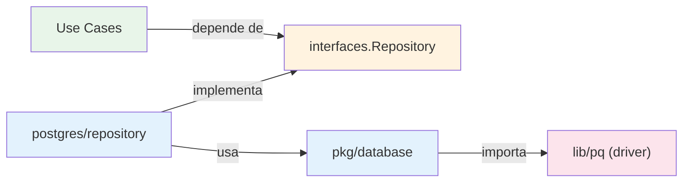
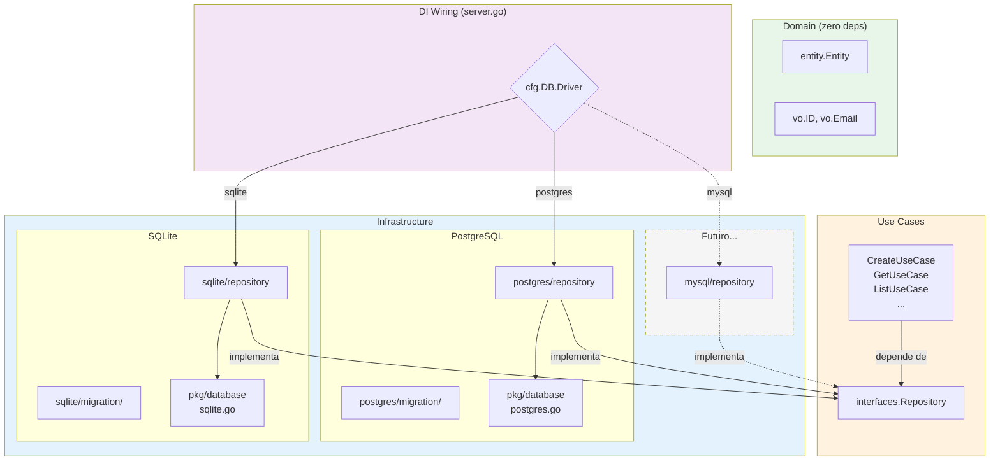

# Estrategia Multi-Database

Este guia explica como a camada de banco de dados esta desacoplada e como adicionar um novo driver (ex: SQLite, MySQL) sem alterar domain ou use cases.

---

## Arquitetura Atual

### Cadeia de Dependencias



### O que esta desacoplado

| Camada | Arquivo | Acoplamento |
| ------ | ------- | ----------- |
| Domain | `internal/domain/entity_example/` | Zero -- nao sabe que banco existe |
| Use Cases | `internal/usecases/entity_example/` | Zero -- depende so da interface `Repository` |
| Interface | `usecases/.../interfaces/repository.go` | Zero -- contrato puro Go |
| Repository | `infrastructure/db/postgres/repository/` | PostgreSQL (queries, placeholders) |
| Connection | `pkg/database/postgres.go` | PostgreSQL (driver `lib/pq`) |

> **Regra de ouro**: Domain e Use Cases **nunca mudam** ao trocar de banco. So a camada de infrastructure e afetada.

---

## Pontos de Acoplamento com PostgreSQL

Antes de implementar um novo driver, e importante entender exatamente onde o PostgreSQL esta hardcoded:

### 1. Driver e conexao (`pkg/database/postgres.go`)

```go
import _ "github.com/lib/pq"  // driver PostgreSQL

func NewConnection(cfg Config) (*sqlx.DB, error) {
    db, connectErr := sqlx.Connect("postgres", cfg.DSN)  // driver hardcoded
    // ...
}
```

### 2. Placeholders nas queries (`infrastructure/db/postgres/repository/`)

PostgreSQL usa `$1, $2, $3` (posicional). SQLite e MySQL usam `?` (posicional sem numero):

```go
// PostgreSQL (atual)
query := `SELECT ... FROM entities WHERE id = $1`

// SQLite / MySQL
query := `SELECT ... FROM entities WHERE id = ?`
```

> **Nota**: Queries que usam `NamedExecContext` com `:field` nao tem esse problema -- sqlx faz o Rebind automaticamente. Apenas queries com placeholders explicitos precisam de adaptacao.

### 3. Operador ILIKE (`repository/entity_example.go:137`)

`ILIKE` e uma extensao PostgreSQL para busca case-insensitive. Alternativas por banco:

| Banco | Equivalente ao ILIKE |
| ----- | -------------------- |
| PostgreSQL | `ILIKE` |
| SQLite | `LIKE` (ja e case-insensitive por default para ASCII) |
| MySQL | `LIKE` (depende do collation da tabela) |

### 4. Tipos na migration (`migration/20240101002_init_entities.sql`)

| Tipo PostgreSQL | SQLite | MySQL |
| --------------- | ------ | ----- |
| `UUID` | `TEXT` | `CHAR(36)` ou `BINARY(16)` |
| `TIMESTAMP WITH TIME ZONE` | `TEXT` (ISO 8601) | `DATETIME` |
| `BOOLEAN` | `INTEGER` (0/1) | `TINYINT(1)` |
| `VARCHAR(255)` | `TEXT` | `VARCHAR(255)` |
| Partial index (`WHERE active = true`) | Nao suportado | Nao suportado |

---

## Passo a Passo: Adicionando SQLite

### Passo 1: Estrutura de diretorios

Criar a infraestrutura SQLite espelhando a estrutura do PostgreSQL:

```text
internal/infrastructure/db/
  postgres/                     # ja existe
    repository/
      entity_example.go
    migration/
      20240101002_init_entities.sql
  sqlite/                       # NOVO
    repository/
      entity_example.go
    migration/
      001_init_entities.sql
```

### Passo 2: Conexao SQLite (`pkg/database/sqlite.go`)

Criar uma nova funcao de conexao para SQLite:

```go
package database

import (
    "context"
    "fmt"
    "time"

    "github.com/jmoiron/sqlx"
    _ "github.com/mattn/go-sqlite3"
)

// NewSQLiteConnection cria uma conexao SQLite.
// dsn pode ser um path de arquivo ("data.db") ou ":memory:" para testes.
func NewSQLiteConnection(cfg Config) (*sqlx.DB, error) {
    db, connectErr := sqlx.Connect("sqlite3", cfg.DSN)
    if connectErr != nil {
        return nil, fmt.Errorf("failed to connect to sqlite: %w", connectErr)
    }

    // SQLite nao suporta pool da mesma forma, mas podemos configurar
    db.SetMaxOpenConns(1) // SQLite e single-writer
    db.SetMaxIdleConns(1)
    db.SetConnMaxLifetime(cfg.ConnMaxLifetime)

    // WAL mode para melhor performance de leitura concorrente
    if _, walErr := db.Exec("PRAGMA journal_mode=WAL"); walErr != nil {
        return nil, fmt.Errorf("failed to enable WAL mode: %w", walErr)
    }

    // Foreign keys nao sao habilitados por default no SQLite
    if _, fkErr := db.Exec("PRAGMA foreign_keys=ON"); fkErr != nil {
        return nil, fmt.Errorf("failed to enable foreign keys: %w", fkErr)
    }

    ctx, cancel := context.WithTimeout(context.Background(), 5*time.Second)
    defer cancel()

    if pingErr := db.PingContext(ctx); pingErr != nil {
        return nil, fmt.Errorf("failed to ping sqlite: %w", pingErr)
    }

    return db, nil
}

// NewSQLiteCluster cria um DBCluster para SQLite.
// SQLite nao tem conceito de reader/writer separados,
// entao o mesmo *sqlx.DB e usado para ambos.
func NewSQLiteCluster(cfg Config) (*DBCluster, error) {
    db, connErr := NewSQLiteConnection(cfg)
    if connErr != nil {
        return nil, connErr
    }
    return NewDBClusterFromDB(db), nil
}
```

> **Importante**: `DBCluster` continua funcionando -- SQLite simplesmente nao tera reader separado, usando o fallback automatico para o writer.

### Passo 3: Migration SQLite (`internal/infrastructure/db/sqlite/migration/`)

```sql
-- +goose Up
CREATE TABLE entities (
    id TEXT PRIMARY KEY,
    name TEXT NOT NULL,
    email TEXT UNIQUE NOT NULL,
    active INTEGER NOT NULL DEFAULT 1,
    created_at TEXT NOT NULL,
    updated_at TEXT NOT NULL
);

CREATE INDEX idx_entities_active_created ON entities(created_at DESC);

-- +goose Down
DROP TABLE IF EXISTS entities;
```

Diferencas da versao PostgreSQL:

- `UUID` -> `TEXT` (SQLite nao tem tipo UUID nativo)
- `BOOLEAN` -> `INTEGER` (0/1)
- `TIMESTAMP WITH TIME ZONE` -> `TEXT` (formato ISO 8601)
- Sem partial index (SQLite nao suporta `WHERE` em index)

### Passo 4: Repository SQLite (`internal/infrastructure/db/sqlite/repository/`)

```go
package repository

import (
    "context"
    "database/sql"
    "errors"
    "fmt"
    "strings"
    "time"

    entity "bitbucket.org/appmax-space/go-boilerplate/internal/domain/entity_example"
    "bitbucket.org/appmax-space/go-boilerplate/internal/domain/entity_example/vo"
    "bitbucket.org/appmax-space/go-boilerplate/pkg/database"
    "github.com/jmoiron/sqlx"
)

// entityDB e o modelo de banco de dados para SQLite.
// Identico ao do PostgreSQL -- o mapping nao muda entre bancos.
type entityDB struct {
    ID        string    `db:"id"`
    Name      string    `db:"name"`
    Email     string    `db:"email"`
    Active    bool      `db:"active"`
    CreatedAt time.Time `db:"created_at"`
    UpdatedAt time.Time `db:"updated_at"`
}

// toEntity e fromDomainEntity sao identicos ao PostgreSQL
// (omitidos por brevidade -- copiar de postgres/repository)

type EntityRepository struct {
    cluster *database.DBCluster
}

func NewEntityRepository(cluster *database.DBCluster) *EntityRepository {
    return &EntityRepository{cluster: cluster}
}

func (r *EntityRepository) Create(ctx context.Context, e *entity.Entity) error {
    // Mesma query -- NamedExec com :field funciona em qualquer banco via sqlx
    query := `
        INSERT INTO entities (
            id, name, email, active, created_at, updated_at
        ) VALUES (
            :id, :name, :email, :active, :created_at, :updated_at
        )
    `
    dbModel := fromDomainEntity(e)
    _, execErr := r.cluster.Writer().NamedExecContext(ctx, query, dbModel)
    return execErr
}

func (r *EntityRepository) FindByID(ctx context.Context, id vo.ID) (*entity.Entity, error) {
    // Diferenca: usa ? em vez de $1
    query := `
        SELECT id, name, email, active, created_at, updated_at
        FROM entities
        WHERE id = ?
    `
    var dbModel entityDB
    selectErr := r.cluster.Reader().GetContext(ctx, &dbModel, query, id.String())
    if selectErr != nil {
        if errors.Is(selectErr, sql.ErrNoRows) {
            return nil, entity.ErrEntityNotFound
        }
        return nil, selectErr
    }
    return dbModel.toEntity()
}

func (r *EntityRepository) List(ctx context.Context, filter entity.ListFilter) (*entity.ListResult, error) {
    filter.Normalize()

    var conditions []string
    args := make(map[string]interface{})

    if filter.ActiveOnly {
        conditions = append(conditions, "active = 1") // SQLite: 1 em vez de true
    }
    if filter.Name != "" {
        conditions = append(conditions, "name LIKE :name") // LIKE em vez de ILIKE
        args["name"] = "%" + filter.Name + "%"
    }
    if filter.Email != "" {
        conditions = append(conditions, "email LIKE :email")
        args["email"] = "%" + filter.Email + "%"
    }

    // ... restante identico ao PostgreSQL (tx.Rebind cuida dos placeholders)
}
```

#### Diferencas-chave do PostgreSQL

| Aspecto | PostgreSQL | SQLite |
| ------- | ---------- | ------ |
| Placeholder | `$1, $2` | `?` |
| Boolean | `true/false` | `1/0` |
| Case-insensitive search | `ILIKE` | `LIKE` (default) |
| Read-only transaction | `&sql.TxOptions{ReadOnly: true}` | Nao suportado (remover) |
| Named params (`:field`) | Funciona via sqlx | Funciona via sqlx |

### Passo 5: Wiring no DI (`cmd/api/server.go`)

Alterar `buildDependencies` para escolher a implementacao baseada em configuracao:

```go
import (
    pgrepository "bitbucket.org/appmax-space/go-boilerplate/internal/infrastructure/db/postgres/repository"
    sqliterepository "bitbucket.org/appmax-space/go-boilerplate/internal/infrastructure/db/sqlite/repository"
    "bitbucket.org/appmax-space/go-boilerplate/internal/usecases/entity_example/interfaces"
)

func buildDependencies(cluster *database.DBCluster, cfg *config.Config, ...) router.Dependencies {
    // Escolher repository baseado no driver configurado
    var repo interfaces.Repository
    switch cfg.DB.Driver {
    case "sqlite":
        repo = sqliterepository.NewEntityRepository(cluster)
    default:
        repo = pgrepository.NewEntityRepository(cluster)
    }

    // Resto do wiring permanece identico
    createUC := entityuc.NewCreateUseCase(repo)
    getUC := entityuc.NewGetUseCase(repo).WithCache(redisClient).WithFlight(flightGroup)
    // ...
}
```

E na criacao do cluster:

```go
// Em Start(), substituir a criacao do cluster:
var cluster *database.DBCluster
var clusterErr error

switch cfg.DB.Driver {
case "sqlite":
    cluster, clusterErr = database.NewSQLiteCluster(database.Config{
        DSN: cfg.DB.SQLitePath,
    })
default:
    cluster, clusterErr = database.NewDBCluster(writerCfg, readerCfg)
}
```

### Passo 6: Configuracao (`config/config.go`)

Adicionar o campo `Driver` a struct de configuracao do banco:

```go
type DB struct {
    Driver   string `env:"DB_DRIVER" envDefault:"postgres"` // "postgres" ou "sqlite"
    // ... campos existentes ...
    SQLitePath string `env:"SQLITE_PATH" envDefault:"data.db"` // so para sqlite
}
```

```bash
# .env para SQLite
DB_DRIVER=sqlite
SQLITE_PATH=./data.db

# .env para PostgreSQL (default, nao muda nada)
DB_DRIVER=postgres
DB_HOST=localhost
DB_PORT=5432
# ...
```

---

## Diagrama Final: Arquitetura Multi-Database



---

## Quando usar cada banco

| Cenario | Banco Recomendado |
| ------- | ----------------- |
| Producao (microservico) | PostgreSQL |
| Testes unitarios/integracao | SQLite `:memory:` |
| CLI tools, apps desktop | SQLite (arquivo) |
| Alta concorrencia de escrita | PostgreSQL |
| Prototipagem rapida | SQLite |
| Cenarios multi-tenant | PostgreSQL |

---

## Checklist para adicionar um novo driver

- [ ] Criar `pkg/database/<driver>.go` com funcao de conexao
- [ ] Criar `internal/infrastructure/db/<driver>/repository/` com implementacao
- [ ] Criar `internal/infrastructure/db/<driver>/migration/` com DDL adaptado
- [ ] Adicionar `case "<driver>"` no switch de `server.go`
- [ ] Adicionar variavel `DB_DRIVER` na config
- [ ] Escrever testes para o novo repository (sqlmock ou banco real)
- [ ] Documentar variaveis de ambiente
- [ ] **Nao alterar** domain, use cases ou handlers

---

## Referencia Rapida: O que muda e o que nao muda

```text
Trocar de banco de dados:

  NAO MUDA                          MUDA
  internal/domain/                  pkg/database/<novo_driver>.go
  internal/usecases/                internal/infrastructure/db/<novo_driver>/
  internal/infrastructure/web/        repository/
  pkg/cache/                          migration/
  pkg/httputil/                     config/config.go (novo campo Driver)
  pkg/apperror/                     cmd/api/server.go (switch no DI)
  tests/ (E2E usam interface)
```
